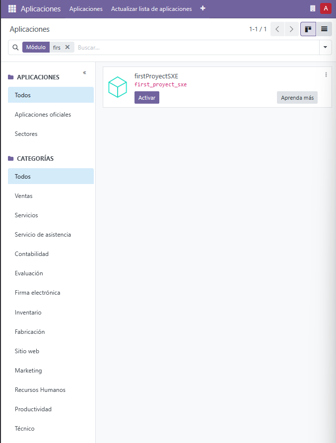
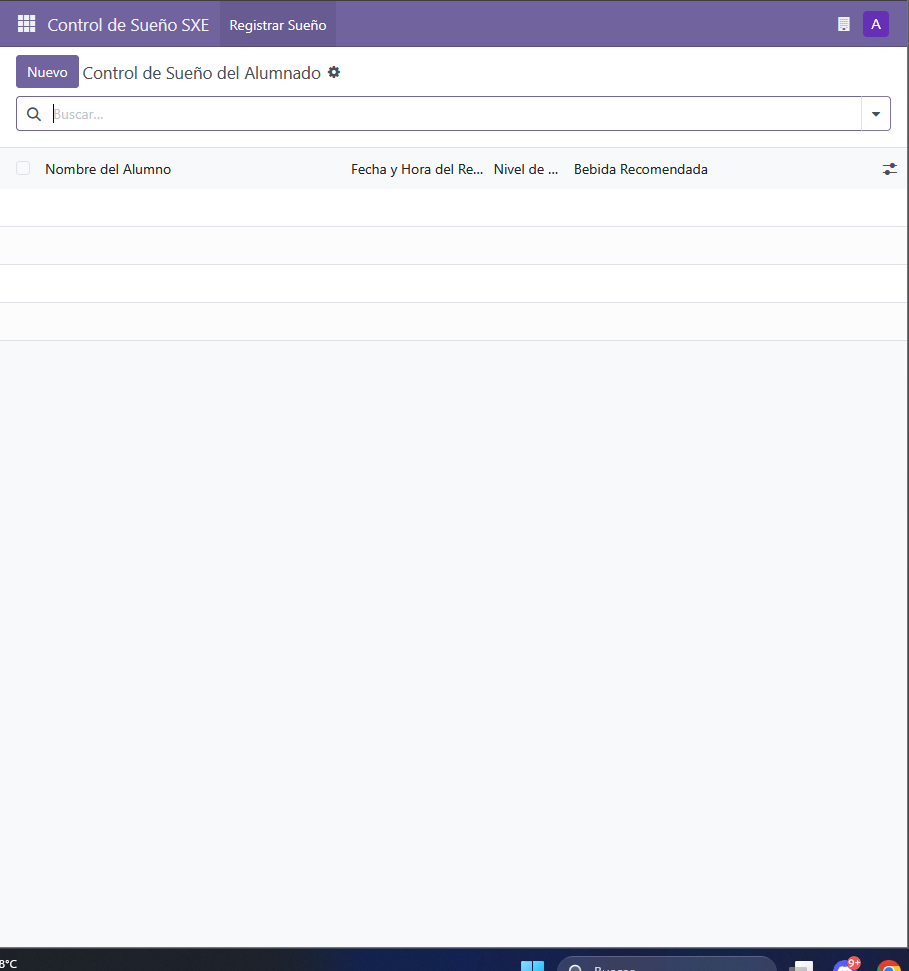
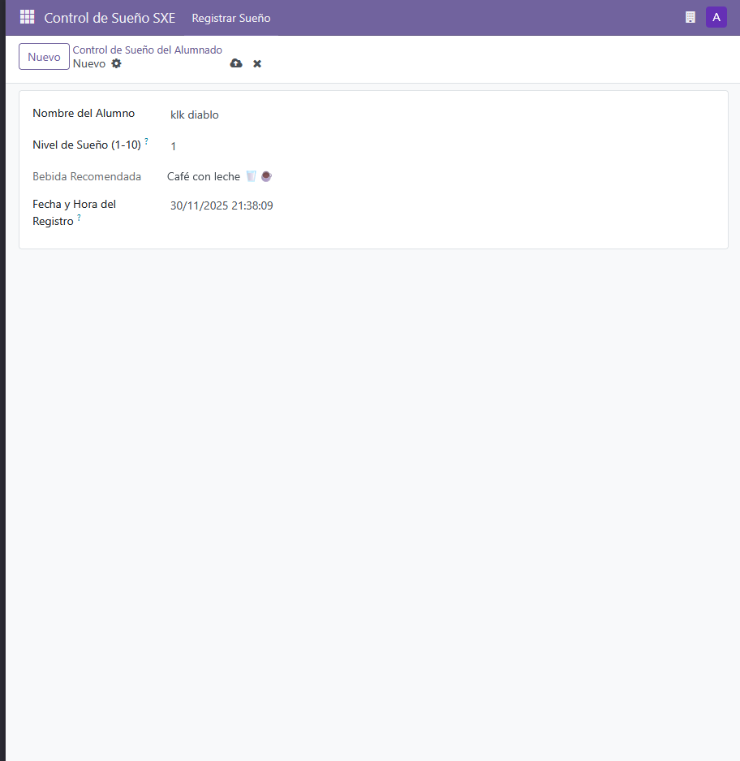
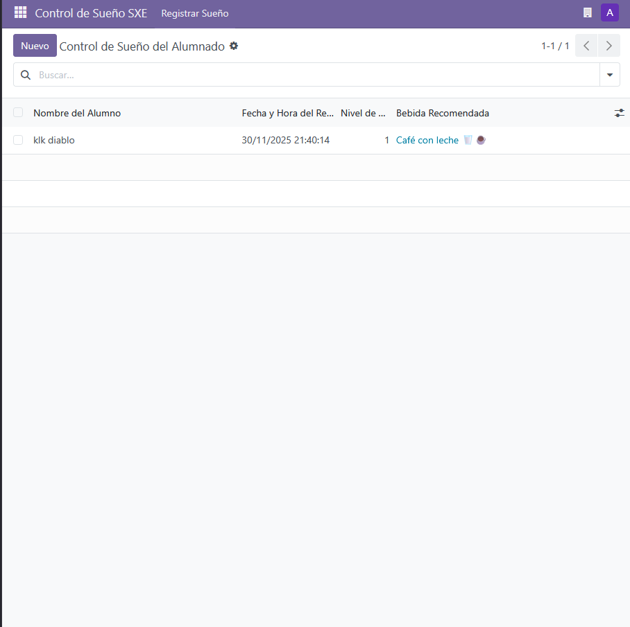
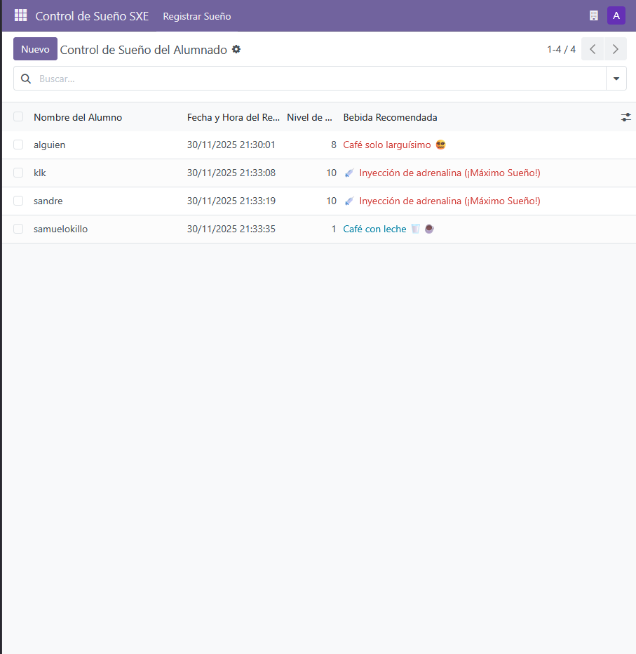
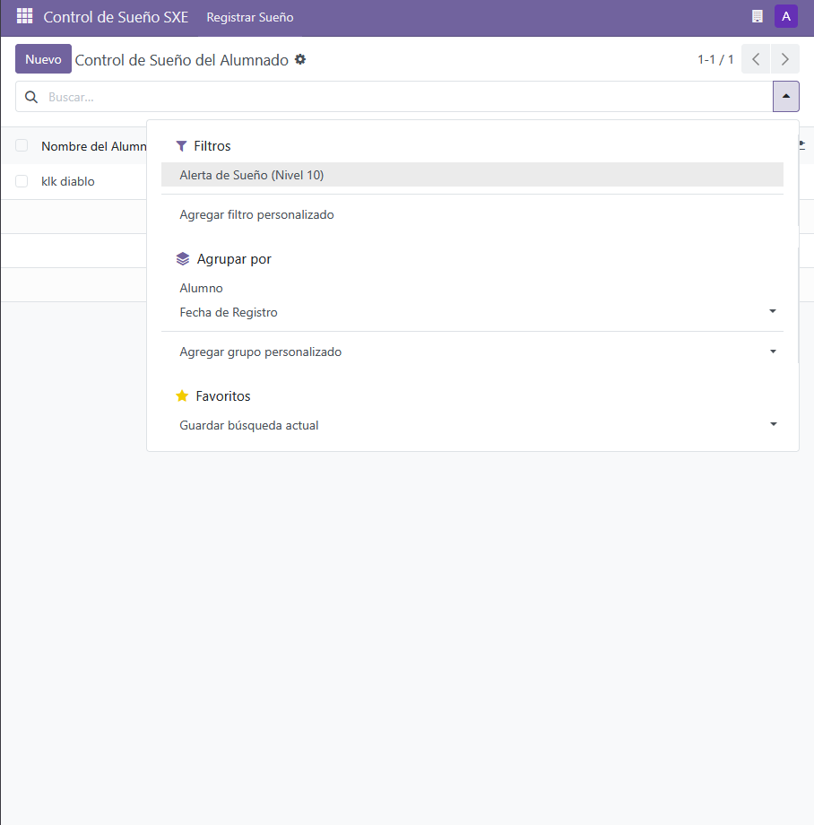
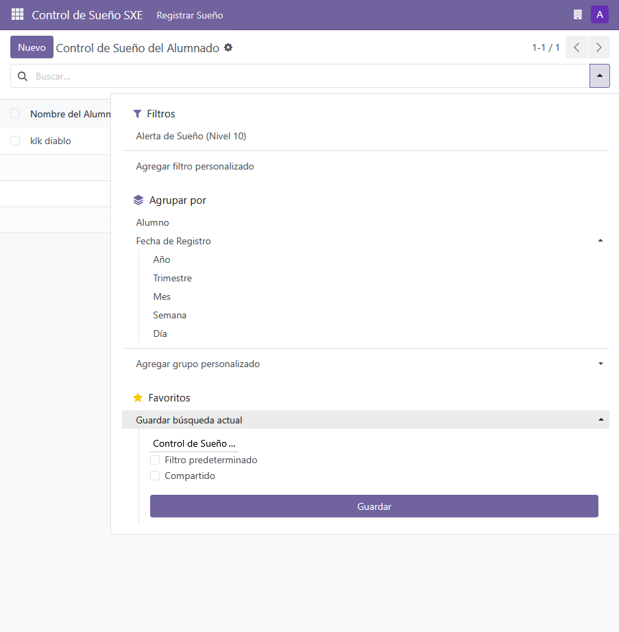

---

# 📄 Guía de Importación de un nuevo módulo en Odoo

> **✅ Compatible con**: Odoo Community v18.0  
> **🧑‍💻 Autor**: Samuel Hermida Gregores

---

## 🗂️ Paso 1: Estructura inicial del proyecto

Primero crearemos nuestra estructura del proyecto **sin datos**, para a posteriori establecer lo necesario.


---

### 🛠️ Creación del *scaffold* del módulo

Se empezará creando el *scaffold* de nuestro proyecto mediante los siguientes comandos e instrucciones:

```dotenv
Se ejecutará el docker ps para identificar qué contenedores están activos actualmente y así poder entrar a la consola de nuestro contenedor Odoo.

Comando --> docker ps 

Proseguido, cogeremos la ID de nuestro contenedor de Odoo para así poder ejecutar el exec sobre el mismo y entrar en la terminal.

Comando --> docker exec -it <Id de tu contenedor> bash

Dentro ya de la bash, ejecutaremos el comando para así poder crear el scaffold. Este mismo lo que hace es crear las carpetas necesarias para la creación del módulo a posteriori.

Comando --> odoo scaffold <Nombre que le vayas a dar a tu proyecto> /mnt/extra-addons/
```

---

#### 💡 Ejemplo de uso


---

### 🐳 Configuración de `docker-compose.yaml`

Teniendo ya este formato, crearemos nuestro archivo `docker-compose.yaml` para levantar nuestro servicio Odoo:

```yaml
services:
  web:
    image: odoo:18.0
    container_name: "odoo"
    depends_on:
      - mydb
    ports:
      - "8069:8069"
    environment:
      - HOST=mydb
      - USER=odoo
      - PASSWORD=myodoo
    volumes:
      - odoo:/var/lib/odoo
      - ./config:/etc/odoo
      - ./extra-addons:/mnt/extra-addons

  mydb:
    image: postgres:15
    container_name: "postgres"
    environment:
      - POSTGRES_DB=postgres
      - POSTGRES_PASSWORD=myodoo
      - POSTGRES_USER=odoo
    volumes:
      - db_odoo:/var/lib/postgresql/data

  pgAdmin:
    image: dpage/pgadmin4
    container_name: "pgAdmin"
    depends_on:
      - mydb
    ports:
      - "8081:80"
    environment:
      - PGADMIN_DEFAULT_EMAIL=shermidagre@gmail.com
      - PGADMIN_DEFAULT_PASSWORD=sxe_password_example
    volumes:
      - dbadmin_data:/var/lib/pgadmin

volumes:
  db_odoo:
  odoo:
  dbadmin_data:
```

---

### 📦 Archivo `__manifest__.py` (Manifest)

Especificaremos las características del módulo que queremos crear en Odoo en el archivo **Manifest**.

> Aquí irán las especificaciones básicas, pero se pueden incluir más campos si es necesario.

```env
# -*- coding: utf-8 -*-
{

    'name': "firstProyectSXE",
    'summary': "Módulo para ver que alumno esta mas dormido 0",

    'description': """ 
    Un grupo de alumnos del Daniel Castelao, se están acostando tarde porque
    estudian mucho y pican mucho código en casa. En ocasiones, a la mañana
    siguiente en el centro, tienen sueño en clase, pero no tienen claro por qué opción
    decantarse de entre las maravillosas ofertas de los establecimientos que rodean el
    centro. Como tienen dudas de qué escoger, un compañero decide realizar un
    módulo sencillo que establece la bebida que deben tomar en función del nivel de
    sueño que tengan.
    Para evitar que tus compañeros se duerman en clase, debes desarrollar un módulo
    en Odoo que asigne la bebida adecuada según el sueño de cada usuario.""",

    'author': "Samuel Hermida Gregores",
    'website': "https://www.algo.org",

    'category': 'Uncategorized',
    'version': '0.1',

    'depends': ['base'],

    'data': [
        'security/ir.model.access.csv',
        'views/views.xml',
        'views/templates.xml'
    ],

    'demo':[
        'demo/demo.xml'
    ],
}
```

---

## 🧪 Pruebas: Levantar y probar el módulo

### Paso 1: Crear base de datos


---

### Paso 2: Buscar y activar el módulo

#### 🔐 Iniciar sesión


#### 🔍 Activar modo desarrollador y buscar el módulo


#### 📥 Instalar el módulo



---

### 🎉 ¡Módulo instalado!

> Tan pronto se realiza la instalación, automáticamente ya te entra tu aplicación.



---

### ➕ Crear una nueva anotación

Probamos a crear una nueva anotación con su respectiva etiqueta y sus valores.

  


---

### 📝 ¿Qué haremos después de instalar nuestro módulo?

Pues le daremos los valores que requiere el enunciado.



> *A partir de aquí son cookeadas a parte*

---

### 🔍 ¿Quieres filtrarlos?

¡Pam! Aquí lo tienes:



---

### ⭐ ¿Eso no te sirve y también le quieres dar a favoritos?

**¡Pim Pam! Toma Lacasitos! Ahí lo tienes.**



> *Con este tuneillo que le metemos también la hora a la que se inscribió y un par de ejemplos*

---

## 🔗 Enlaces Útiles (v18)

- 📚 **Documentación oficial DockerHub**: [https://hub.docker.com/_/odoo](https://hub.docker.com/_/odoo)
- 📚 **Documentación oficial Odoo**: [https://www.odoo.com/documentation/18.0](https://www.odoo.com/documentation/18.0)

---

## 🆘 Soporte

¿Problemas con la importación?  
📧 **Contacto**: shermidagre@gmail.com

🛠️ **Adjunta**:
- Captura del error

---

> ✨ ¡Y listo! Tu módulo debería estar funcionando correctamente dentro de tu instancia de Odoo Community v18.0.

---