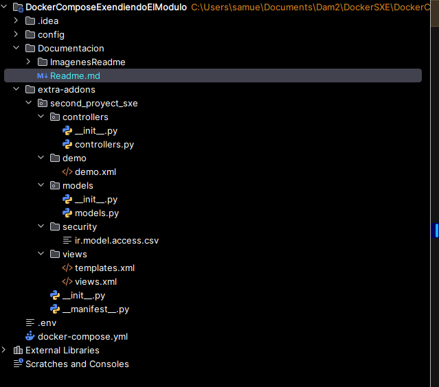

---

# 📄 Guía de Importación de un nuevo módulo en Odoo

> **✅ Compatible con**: Odoo Community v18.0  
> **🧑‍💻 Autor**: Samuel Hermida Gregores

---

## 🗂️ Paso 1: Estructura inicial del proyecto

Primero crearemos nuestra estructura del proyecto **sin datos**, para a posteriori establecer lo necesario.



---

### 🛠️ Creación del *scaffold* del módulo

Se empezará creando el *scaffold* de nuestro proyecto mediante los siguientes comandos e instrucciones:

```dotenv
Se ejecutará el docker ps para identificar qué contenedores están activos actualmente y así poder entrar a la consola de nuestro contenedor Odoo.

Comando --> docker ps 

Proseguido, cogeremos la ID de nuestro contenedor de Odoo para así poder ejecutar el exec sobre el mismo y entrar en la terminal.

Comando --> docker exec -it <Id de tu contenedor> bash

Dentro ya de la bash, ejecutaremos el comando para así poder crear el scaffold. Este mismo lo que hace es crear las carpetas necesarias para la creación del módulo a posteriori.

Comando --> odoo scaffold <Nombre que le vayas a dar a tu proyecto> /mnt/extra-addons/
```

---

#### 💡 Ejemplo de uso


---

### 🐳 Configuración de `docker-compose.yaml`

Teniendo ya este formato, crearemos nuestro archivo `docker-compose.yaml` para levantar nuestro servicio Odoo:

```yaml
services:
  web:
    image: odoo:18.0
    container_name: "odoo"
    depends_on:
      - mydb
    ports:
      - "8069:8069"
    environment:
      - HOST=mydb
      - USER=odoo
      - PASSWORD=myodoo
    volumes:
      - odoo:/var/lib/odoo
      - ./config:/etc/odoo
      - ./extra-addons:/mnt/extra-addons

  mydb:
    image: postgres:15
    container_name: "postgres"
    environment:
      - POSTGRES_DB=postgres
      - POSTGRES_PASSWORD=myodoo
      - POSTGRES_USER=odoo
    volumes:
      - db_odoo:/var/lib/postgresql/data

  pgAdmin:
    image: dpage/pgadmin4
    container_name: "pgAdmin"
    depends_on:
      - mydb
    ports:
      - "8081:80"
    environment:
      - PGADMIN_DEFAULT_EMAIL=shermidagre@gmail.com
      - PGADMIN_DEFAULT_PASSWORD=sxe_password_example
    volumes:
      - dbadmin_data:/var/lib/pgadmin

volumes:
  db_odoo:
  odoo:
  dbadmin_data:
```

---

### 📦 Archivo `__manifest__.py` (Manifest)

Especificaremos las características del módulo que queremos crear en Odoo en el archivo **Manifest**.

> Aquí irán las especificaciones básicas, pero se pueden incluir más campos si es necesario.

```env
# -*- coding: utf-8 -*-
{
    'name': "second_proyect_sxe",

    'summary': "Modulo que permite ver el signo del horoscopo chino ",

    'description': """
        Este modulo extiende el modelo res_parter añadiendo los siguientes 3 campos a contactos:
         Fecha de nacimiento
         Edad (Calculada automaticamente)
         Signo del horoscopo chino (calculado automaticamente)
    """,

    'author': "Alumno esclavista",
    'website': "https://www.noleolosuficientecomoparaquejarme.com",

    # Categories can be used to filter modules in modules listing
    # Check https://github.com/odoo/odoo/blob/15.0/odoo/addons/base/data/ir_module_category_data.xml
    # for the full list
    'category': 'Uncategorized',
    'version': '0.1',

    # any module necessary for this one to work correctly
    'depends': ['base','contacts'],

    # always loaded
    'data': [
        # 'security/ir.model.access.csv',
        'views/views.xml',
        'views/templates.xml',
    ],
    # only loaded in demonstration mode
    'demo': [
        'demo/demo.xml',
    ],
}
```
### 📦 Archivo `models.py` (Models)

```env

# -*- coding: utf-8 -*-

from odoo import models, fields, api
from datetime import date

class second_proyect_sxe(models.Model):
    _inherit = 'res.partner'

    f_nac = fields.Date("Fecha de nacimiento")

    edad = fields.Integer(string="Edad", readonly=True, compute="_calcular_edad_china", store=True)
    signo_chino = fields.Char(string="Signo Chino", readonly=True, compute="_calcular_chinada", store=True)

    codigo_socio = fields.Char(string="Código de Socio")

    nivel_fidelidad = fields.Selection(
        [
            ('estandar', 'Estándar'),
            ('premium', 'Premium'),
            ('gold', 'Gold')
        ],
        string="Nivel de Fidelidad",
        compute="_compute_nivel_fidelidad",
        store=True,
        default='estandar'
    )

    @api.depends('f_nac')
    def _calcular_edad_china(self):
        for record in self:
            if record.f_nac:
                today = date.today()
                # Fórmula precisa para edad teniendo en cuenta si ya cumplió años o no
                age = today.year - record.f_nac.year - ((today.month, today.day) < (record.f_nac.month, record.f_nac.day))
                record.edad = age
            else:
                record.edad = 0

    @api.depends('f_nac')
    def _calcular_chinada(self):
        # Lista ordenada según el resto de dividir año / 12
        zodiacos = ['Mono', 'Gallo', 'Perro', 'Cerdo', 'Rata', 'Buey', 'Tigre', 'Conejo', 'Dragón', 'Serpiente', 'Caballo', 'Cabra']
        for record in self:
            if record.f_nac:
                indice = record.f_nac.year % 12
                record.signo_chino = zodiacos[indice]
            else:
                record.signo_chino = "Desconocido"

    @api.depends('codigo_socio')
    def _compute_nivel_fidelidad(self):
        for record in self:
            if not record.codigo_socio:
                record.nivel_fidelidad = 'estandar'
            elif record.codigo_socio.upper().startswith('G'):
                record.nivel_fidelidad = 'gold'
            else:
                record.nivel_fidelidad = 'premium'

```

### 📦 Archivo `views.xml` (views)

```env
<odoo>
    <data>

        <record id="view_partner_form_sxe_extensions" model="ir.ui.view">
            <field name="name">res.partner.form.sxe.extensions</field>
            <field name="model">res.partner</field>
            <field name="inherit_id" ref="base.view_partner_form"/>
            <field name="arch" type="xml">
                <xpath expr="//notebook" position="inside">
                    <page string="Signo Chino">
                        <group>
                            <field name="f_nac"/>
                            <field name="edad"/>
                            <field name="signo_chino"/>
                        </group>
                    </page>
                    <page string="Membresía">
                        <group>
                            <field name="codigo_socio" placeholder="Ej: G-1234"/>
                            <field name="nivel_fidelidad"/>
                        </group>
                    </page>
                </xpath>
            </field>
        </record>

        <record id="view_partner_tree_sxe_extensions" model="ir.ui.view">
            <field name="name">res.partner.tree.sxe.extensions</field>
            <field name="model">res.partner</field>
            <field name="inherit_id" ref="base.view_partner_tree"/>
            <field name="arch" type="xml">
                <field name="complete_name" position="after">
                    <field name="signo_chino" optional="show"/>
                    <field name="nivel_fidelidad"
                           widget="badge"
                           decoration-info="nivel_fidelidad in ('premium', 'gold')"
                           decoration-muted="nivel_fidelidad == 'estandar'"/>
                </field>
            </field>
        </record>

        <record id="view_partner_kanban_sxe_extensions" model="ir.ui.view">
            <field name="name">res.partner.kanban.sxe.extensions</field>
            <field name="model">res.partner</field>
            <field name="inherit_id" ref="base.res_partner_kanban_view"/>
            <field name="arch" type="xml">
                <xpath expr="//field[@name='display_name']" position="after">

                    <div t-if="record.signo_chino.raw_value">
                        <span class="text-muted">Horóscopo: </span>
                        <field name="signo_chino"/>
                    </div>

                    <div t-if="record.codigo_socio.raw_value">
                        <span class="text-muted">Socio: </span>
                        <strong><field name="codigo_socio"/></strong>
                    </div>

                </xpath>
            </field>
        </record>

    </data>
</odoo>
```

---

## 🧪 Pruebas: Levantar y probar el módulo

### Paso 1: Crear base de datos


---

### Paso 2: PgAdmin

#### Iniciamos sesion


#### Conectamos nuestro odoo


---


### Paso 3: Buscar y activar el módulo

#### 🔐 Iniciar sesión


#### Activamos la app contactos para a posterior


#### 📥 Instalar el módulo y comprobar res_parter

[](https://youtu.be/p2IjtaCv_sE)

> 💡 Haz clic en la imagen para abrir el tutorial en YouTube.

---

### 🎉 ¡Módulo instalado!

> Tan pronto se realiza la instalación debe entrar a contactos y a partir de ahi ir probando cosillas.

---

### 📝 Manual de uso

####  ¿Qué haremos después de instalar nuestro módulo?

#### 1\. Gestión de Datos Demográficos (Zodiaco)

Para calcular la edad y el signo chino de un contacto:

1.  Navega a la aplicación **Contactos**.
2.  Abre un contacto existente o crea uno nuevo.
3.  Busca la pestaña **"Signo Chino"** dentro del formulario.
4.  Establece la **Fecha de nacimiento**.
5.  **Resultado:** Los campos *Edad* y *Signo del horóscopo chino* se calcularán automáticamente al guardar o cambiar la fecha.

> **Nota:** Si la fecha se deja vacía, la edad será 0 y el signo aparecerá como "Desconocido".

### 2\. Gestión de Fidelización (Membresía)

El nivel de fidelidad se asigna automáticamente según el código introducido:

1.  Dentro del contacto, ve a la pestaña **"Membresía"**.
2.  Introduce un valor en el campo **Código de Socio**:
    * **Caso A (Nivel Estándar):** Deja el campo vacío.
    * **Caso B (Nivel Premium):** Escribe cualquier código (ej: `VIP-100`, `SOCIO-555`).
    * **Caso C (Nivel Gold):** Escribe un código que empiece por **"G"** (mayúscula o minúscula). Ej: `G-2025`, `gold-user`.
3.  El campo **Nivel de Fidelidad** cambiará automáticamente (es de solo lectura).

-----

## 👁️ Guía Visual de Vistas

El módulo modifica las vistas principales para facilitar la identificación rápida de los socios VIP.

### Vista de Lista (Tree)

En el listado general de contactos, verás dos nuevas columnas al final:

* **Signo Chino:** (Opcional, puede ocultarse).
* **Nivel de Fidelidad:** Se muestra como una etiqueta (**Badge**).
    * Si es *Premium* o *Gold*, la etiqueta aparecerá resaltada en color **Azul Claro**.
    * Si es *Estándar*, aparecerá en color gris.

### Vista Kanban (Tarjetas)

En la vista de tarjetas, se ha añadido información extra debajo del nombre del contacto:

1.  **Horóscopo:** Muestra el animal del zodiaco (si tiene fecha de nacimiento).
2.  **Socio:** Muestra el Código de Socio en **Negrita** para destacar a los miembros del club.

-----

## 🛠️ Estructura del Proyecto

* `models/models.py`: Contiene la lógica Python (`_calcular_edad_china`, `_compute_nivel_fidelidad`).
* `views/views.xml`: Define las pestañas nuevas en el Formulario, las columnas en el Tree y los campos en el Kanban.
* `__manifest__.py`: Archivo de configuración y dependencias del módulo.

-----

## 🔗 Enlaces Útiles (v18)

- 📚 **Documentación oficial DockerHub**: [https://hub.docker.com/_/odoo](https://hub.docker.com/_/odoo)
- 📚 **Documentación oficial Odoo**: [https://www.odoo.com/documentation/18.0](https://www.odoo.com/documentation/18.0)

---

## 🆘 Soporte

¿Problemas con la importación?  
📧 **Contacto**: shermidagre@gmail.com

🛠️ **Adjunta**:
- Captura del error

---

> ✨ ¡Y listo! Tu módulo debería estar funcionando correctamente dentro de tu instancia de Odoo Community v18.0.

---
