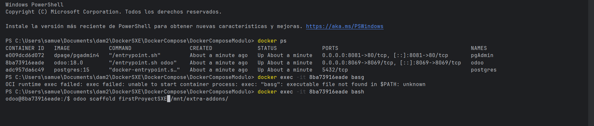
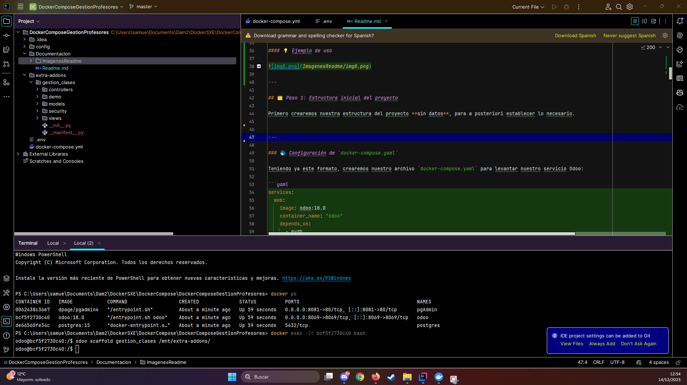
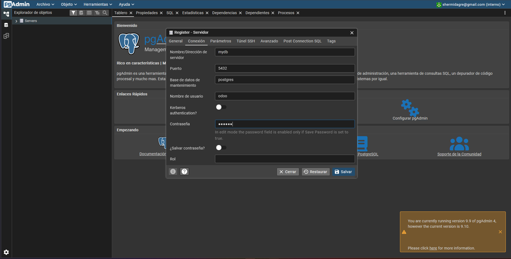
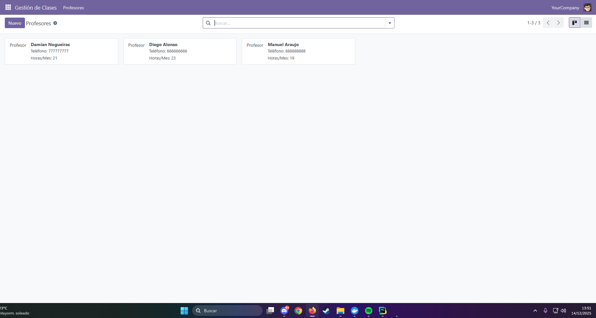

---

# 📄 Guía de Importación de un nuevo módulo en Odoo

> **✅ Compatible con**: Odoo Community v18.0  
> **🧑‍💻 Autor**: Samuel Hermida Gregores

---

### 🛠️ Creación del *scaffold* del módulo

Se empezará creando el *scaffold* de nuestro proyecto mediante los siguientes comandos e instrucciones:

```dotenv

Ejecutaremos primerameente nuestro contenedor de Odoo mediante docker-compose up 

Comando --> docker-compose up 

Se ejecutará el docker ps para identificar qué contenedores están activos actualmente y así poder entrar a la consola de nuestro contenedor Odoo.

Comando --> docker ps 

Proseguido, cogeremos la ID de nuestro contenedor de Odoo para así poder ejecutar el exec sobre el mismo y entrar en la terminal.

Comando --> docker exec -it <Id de tu contenedor> bash

Dentro ya de la bash, ejecutaremos el comando para así poder crear el scaffold. Este mismo lo que hace es crear las carpetas necesarias para la creación del módulo a posteriori.

Comando --> odoo scaffold <Nombre que le vayas a dar a tu proyecto> /mnt/extra-addons/
```

---

#### 💡 Ejemplo de uso



---

## 🗂️ Paso 1: Estructura inicial del proyecto

Primero crearemos nuestra estructura del proyecto **sin datos**, para a posteriori establecer lo necesario.



---

### 🐳 Configuración de `docker-compose.yaml`

Teniendo ya este formato, crearemos nuestro archivo `docker-compose.yaml` para levantar nuestro servicio Odoo:

```yaml
services:
  web:
    image: odoo:18.0
    container_name: "odoo"
    depends_on:
      - mydb
    ports:
      - "8069:8069"
    environment:
      - HOST=mydb
      - USER=odoo
      - PASSWORD=myodoo
    volumes:
      - odoo:/var/lib/odoo
      - ./config:/etc/odoo
      - ./extra-addons:/mnt/extra-addons

  mydb:
    image: postgres:15
    container_name: "postgres"
    environment:
      - POSTGRES_DB=postgres
      - POSTGRES_PASSWORD=myodoo
      - POSTGRES_USER=odoo
    volumes:
      - db_odoo:/var/lib/postgresql/data

  pgAdmin:
    image: dpage/pgadmin4
    container_name: "pgAdmin"
    depends_on:
      - mydb
    ports:
      - "8081:80"
    environment:
      - PGADMIN_DEFAULT_EMAIL=shermidagre@gmail.com
      - PGADMIN_DEFAULT_PASSWORD=admin
    volumes:
      - dbadmin_data:/var/lib/pgadmin

volumes:
  db_odoo:
  odoo:
  dbadmin_data:
```

---

### 📦 Archivo `__manifest__.py` (Manifest)

Especificaremos las características del módulo que queremos crear en Odoo en el archivo **Manifest**.

> Aquí irán las especificaciones básicas, pero se pueden incluir más campos si es necesario.

```env
# -*- coding: utf-8 -*-
{
    'name': "Gestión de Clases",

    'summary': "Gestión de Profesores y Tipos de Cursos",

    'description': """
Permite la gestión de profesores, sus datos de contacto y la asignación a tipos de cursos (Básico, Medio, Superior).
    """,

    'author': "My Company",
    'website': "https://www.yourcompany.com",

    'category': 'Uncategorized',
    'version': '0.1',

    'depends': ['base'],

    # always loaded
    'data': [
        "security/ir.model.access.csv",
        "views/profesor_views.xml",
        "views/menu.xml",
    ],
    # only loaded in demonstration mode
    'demo': [
        'demo/demo.xml',
    ],
}


```
### 📦 Archivo `profesor.py` (Models)

```env

# -*- coding: utf-8 -*-

from odoo import models, fields, api

class Profesor(models.Model):
    _name = "gestion_clases.profesor"
    _description = "Profesor"
    _order = "nombre asc" # Cambio de 'name' a 'nombre'

    nombre = fields.Char(string="Nombre", required=True)
    telefono = fields.Char(string="Teléfono", required=True)
    direccion = fields.Text(string="Dirección")

    cursos = fields.Selection(
        [
            ("basico_medio_superior", "Básico, Medio y Superior"),
            ("solo_superior", "Solo Superior"),
            ("medio_superior", "Medio y Superior"),
        ],
        string="Tipos de Cursos",
        required=True,
        default="basico_medio_superior",
    )

    horas_mensuales = fields.Integer(string="Horas Mensuales de Clase")

    # Campo calculado para Horas Anuales
    horas_anuales = fields.Integer(
        string="Horas Anuales de Clase",
        compute="_calcular_horas_anuales",
        store=True,
    )

    # Método para calcular las horas anuales
    @api.depends('horas_mensuales')
    def _calcular_horas_anuales(self):
        for record in self:
            # Multiplicamos por 10 asumiendo 10 meses de clase
            record.horas_anuales = record.horas_mensuales * 10

```

### 📦 Archivo `profesor_views.xml` (views)

```env
<odoo>
    <data>
        <record id="vista_profesor_form" model="ir.ui.view">
            <field name="name">gestion_clases.profesor.form</field>
            <field name="model">gestion_clases.profesor</field>
            <field name="arch" type="xml">
                <form string="Información del Profesor">
                    <sheet>
                        <group>
                            <field name="nombre"/>
                            <field name="telefono"/>
                            <field name="cursos"/>
                        </group>
                        <group>
                            <field name="horas_mensuales"/>
                            <field name="horas_anuales"/>
                        </group>
                        <group>
                            <field name="direccion"/>
                        </group>
                    </sheet>
                </form>
            </field>
        </record>

        <record id="vista_profesor_lista" model="ir.ui.view">
            <field name="name">gestion_clases.profesor.list</field>
            <field name="model">gestion_clases.profesor</field>
            <field name="arch" type="xml">
                <list>
                    <field name="nombre"/>
                    <field name="telefono"/>
                    <field name="cursos"/>
                    <field name="horas_mensuales"/>
                    <field name="horas_anuales"/>
                </list>
            </field>
        </record>

        <record id="vista_profesor_kanban" model="ir.ui.view">
            <field name="name">gestion_clases.profesor.kanban</field>
            <field name="model">gestion_clases.profesor</field>
            <field name="arch" type="xml">
                <kanban>
                    <field name="nombre"/>
                    <field name="telefono"/>
                    <field name="horas_mensuales"/>
                    <templates>
                        <t t-name="kanban-box">
                            <div t-attf-class="oe_kanban_global_click">
                                <div class="o_kanban_image">
                                    
                                </div>
                                <div class="oe_kanban_details">
                                    <strong><field name="nombre"/></strong>
                                    <ul>
                                        <li t-if="record.telefono.raw_value">Teléfono: <field name="telefono"/></li>
                                        <li>Horas/Mes: <field name="horas_mensuales"/></li>
                                    </ul>
                                </div>
                            </div>
                        </t>
                    </templates>
                </kanban>
            </field>
        </record>

        <record id="accion_profesor" model="ir.actions.act_window">
            <field name="name">Profesores</field>
            <field name="res_model">gestion_clases.profesor</field>
            <field name="view_mode">kanban,list,form</field>
        </record>
    </data>
</odoo>
```

### 📦 Archivo `demo.xml` (demo)

```env
<odoo>
    <data>
        <record id="profesor_diego" model="gestion_clases.profesor">
            <field name="nombre">Diego Alonso</field>
            <field name="telefono">666666666</field>
            <field name="direccion">García Barbón 25</field>
            <field name="cursos">basico_medio_superior</field>
            <field name="horas_mensuales">23</field>
        </record>

        <record id="profesor_damian" model="gestion_clases.profesor">
            <field name="nombre">Damian Nogueiras</field>
            <field name="telefono">777777777</field>
            <field name="direccion">Policarpo Sanz 13</field>
            <field name="cursos">solo_superior</field>
            <field name="horas_mensuales">21</field>
        </record>

        <record id="profesor_manuel" model="gestion_clases.profesor">
            <field name="nombre">Manuel Araujo</field>
            <field name="telefono">888888888</field>
            <field name="direccion">Avda. Gran Vía 80</field>
            <field name="cursos">medio_superior</field>
            <field name="horas_mensuales">19</field>
        </record>
    </data>
</odoo>
```

---

## 🧪 Pruebas: Levantar y probar el módulo

### Paso 1: Crear base de datos


---

### Paso 2: PgAdmin

#### Iniciamos sesion


#### Conectamos nuestro odoo


---




### Paso 3: Buscar y activar el módulo

#### 🔐 Iniciar sesión


#### 📥 Instalar el módulo y comprobar res_parter

[](https://youtu.be/L3bb4TMk_Mw)

> 💡 Haz clic en la imagen para abrir el tutorial en YouTube.

#### En caso de que inicialices la bd de odoo con la opción de carga de datos de demostración, cuando instales el módulo verás los datos de demostración que hemos creado.


---

### 🎉 ¡Módulo instalado!

> Tan pronto se realiza la instalación debe entrar a contactos y a partir de ahi ir probando cosillas.

---

Entendido. Basándome en la estructura y funcionalidad del módulo `gestion_clases.profesor` que hemos desarrollado, aquí tienes un archivo `README.md` (Manual de uso y referencia) con un formato similar al que proporcionaste.

---

# 📝 Manual de Uso del Módulo: Gestión de Clases

Este módulo permite la gestión de profesores, sus datos de contacto y la asignación a tipos de cursos, calculando automáticamente sus horas lectivas anuales.

#### ¿Qué haremos después de instalar nuestro módulo?

### 1. Gestión del Profesor (Datos Demográficos)

Para gestionar la información de contacto y carga lectiva de un profesor:

1.  Navega a la aplicación **Gestión de Clases**.
2.  Haz clic en el submenú **"Profesores"**.
3.  Abre un registro de profesor existente o crea uno nuevo con el botón "Nuevo".
4.  Establece el **Nombre**, **Teléfono** y el **Tipo de Cursos** que imparte.
5.  Introduce la cantidad de **Horas Mensuales de Clase** (ej: `23`).
6.  **Resultado:** El campo *Horas Anuales de Clase* se calculará automáticamente al guardar o cambiar las horas mensuales, asumiendo 10 meses lectivos al año.

> **Nota:** La fórmula de cálculo automático es: $\text{Horas Anuales} = \text{Horas Mensuales} \times 10$.

### 2. Clasificación de Cursos (Selección)

El campo **Tipos de Cursos** permite clasificar rápidamente la experiencia del profesor:

| Opción | Clave interna | Descripción |
| :--- | :--- | :--- |
| **Básico, Medio y Superior** | `basico_medio_superior` | Imparte todos los niveles. |
| **Solo Superior** | `solo_superior` | Solo imparte el nivel más avanzado. |
| **Medio y Superior** | `medio_superior` | Imparte los dos niveles superiores. |

---

## 👁️ Guía Visual de Vistas

El módulo proporciona varias vistas para manejar la información del profesor de manera eficiente.

### Vista de Lista (Tree)

En el listado general de profesores, verás las siguientes columnas para una referencia rápida:

* **Nombre**
* **Teléfono**
* **Tipos de Cursos**
* **Horas Mensuales de Clase**
* **Horas Anuales de Clase** (Calculada)

### Vista Kanban (Tarjetas)

En la vista de tarjetas (predeterminada), se ha añadido información clave visible debajo del nombre del profesor:

1.  **Teléfono:** Muestra el número de contacto.
2.  **Horas/Mes:** Muestra la carga lectiva mensual para planificación rápida.
3.  **Nombre del Profesor** (en negrita)

### Vista de Formulario

Muestra todos los campos del modelo: Nombre, Teléfono, Dirección, Tipos de Cursos, Horas Mensuales y el campo calculado de Horas Anuales.

---

## 🛠️ Estructura del Proyecto (`gestion_clases`)

| Archivo/Directorio | Propósito |
| :--- | :--- |
| `models/profesor.py` | Contiene la lógica Python del modelo `gestion_clases.profesor`, incluyendo el campo calculado `horas_anuales` mediante el método `_calcular_horas_anuales`. |
| `views/profesor_views.xml` | Define las vistas de **Formulario**, **Lista (Tree)** y **Kanban**, y la **Acción de Ventana** (`accion_profesor`). |
| `views/menu.xml` | Define el menú principal **"Gestión de Clases"** y el submenú **"Profesores"**. |
| `demo/demo.xml` | Contiene los tres registros de demostración iniciales (`Diego Alonso`, `Damian Nogueiras`, `Manuel Araujo`). |
| `security/ir.model.access.csv` | Define los permisos de lectura, escritura y creación para el modelo `gestion_clases.profesor`. |
| `__manifest__.py` | Archivo de configuración, metadatos y dependencias del módulo. |

## 🔗 Enlaces Útiles (v18)

- 📚 **Documentación oficial DockerHub**: [https://hub.docker.com/_/odoo](https://hub.docker.com/_/odoo)
- 📚 **Documentación oficial Odoo**: [https://www.odoo.com/documentation/18.0](https://www.odoo.com/documentation/18.0)

---

## 🆘 Soporte

¿Problemas con la importación?  
📧 **Contacto**: shermidagre@gmail.com

🛠️ **Adjunta**:
- Captura del error

---

> ✨ ¡Y listo! Tu módulo debería estar funcionando correctamente dentro de tu instancia de Odoo Community v18.0.

---
