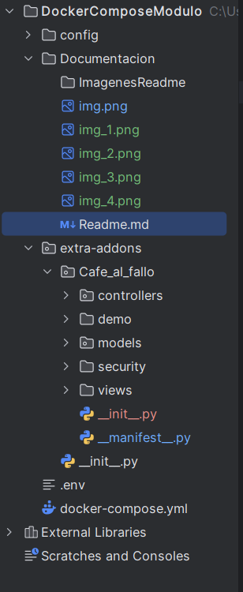
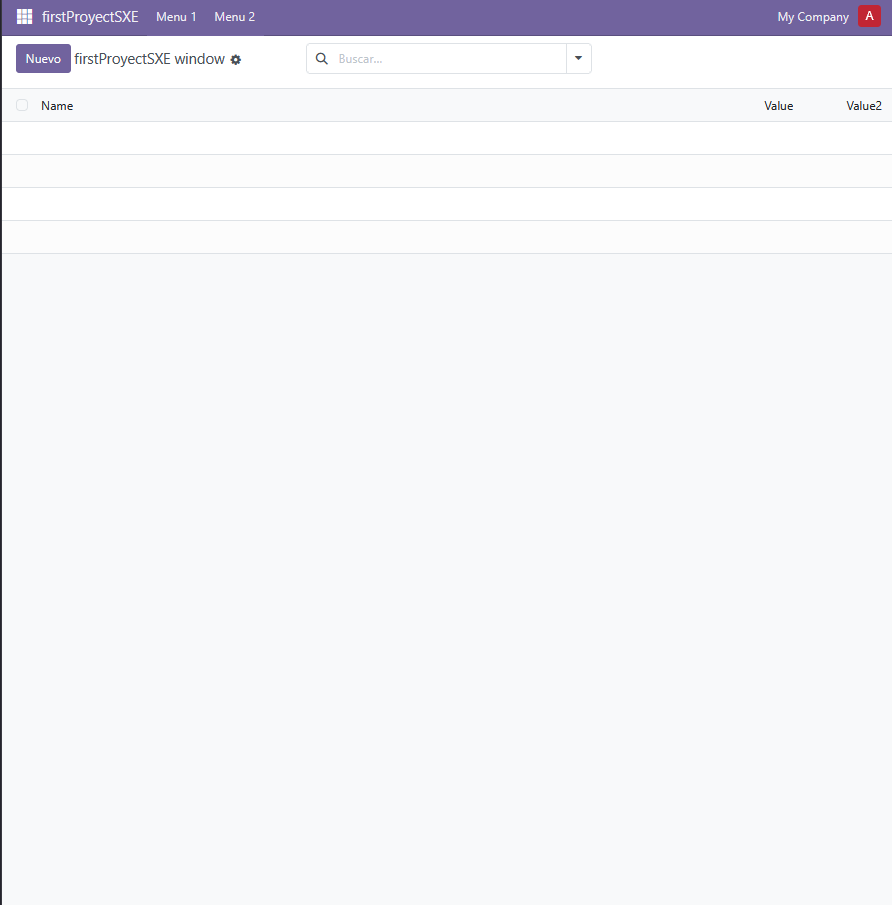
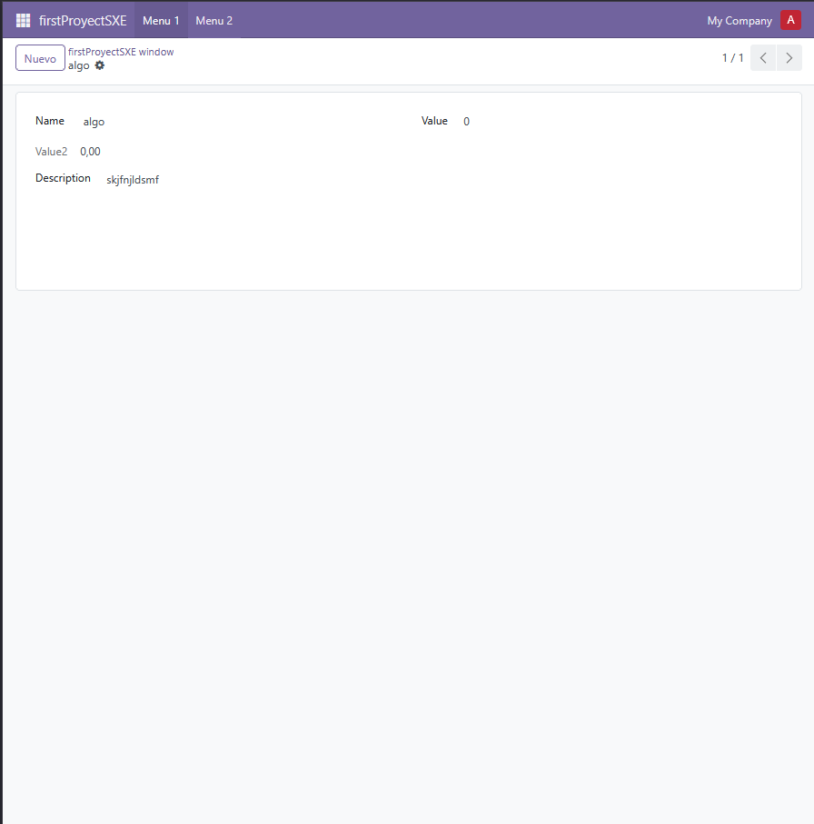

---

# 📄 Guía de Importación de un nuevo modulo en Odoo

> **Compatible con**: Odoo Community v18.0  
> **Autor**: Samuel Hermida Gregores  

---

## Primero crearemos nuestra estructura del proyecto sin datos para a posterior establecer lo necesario



---

### Se empezara creando el scaffold de nuestro proyecto mediante los siguientes comandos e instrucciones


````dotenv

Se ejecutara el docker ps para identificar que contenedores estan activos actualmente y asi poder entrar a la consola de nuestro contenedor odoo

Comando --> docker ps 

Proseguido cogeremos la id de nuestro contenedor de odoo para asi poder ejecutar el exect sobre el mismo y entrar en la terminal 

Comando --> docker exec -it <Id de tu contenedor> bash

Dentro ya de la bash ejecutaremos el comando para asi poder crear el scaffold, este mismo lo que hace es crear las carpetas necesarias para la creacion del modulo a posteriori

Comando --> odoo scaffold <Nombre que le vayas a dar a tu proyecto /mnt/extra-addons/

````
---

#### Ejemplo de uso


---


---

### Teniendo ya este formato crearemos nuestro docker-compose para a posterior levantar nuestro servicio odoo

````dotenv

services:
  web:
    image: odoo:18.0
    container_name: "odoo"
    depends_on:
      - mydb
    ports:
      - "8069:8069"
    environment:
      - HOST=mydb
      - USER=odoo
      - PASSWORD=myodoo
    volumes:
      - odoo:/var/lib/odoo
      - ./config:/etc/odoo
      - ./extra-addons:/mnt/extra-addons

  mydb:
    image: postgres:15
    container_name: "postgres"
    environment:
      - POSTGRES_DB=postgres
      - POSTGRES_PASSWORD=myodoo
      - POSTGRES_USER=odoo
    volumes:
      - db_odoo:/var/lib/postgresql/data

  pgAdmin:
    image: dpage/pgadmin4
    container_name: "pgAdmin"
    depends_on:
      - mydb
    ports:
      - "8081:80"
    environment:
      - PGADMIN_DEFAULT_EMAIL=shermidagre@gmail.com
      - PGADMIN_DEFAULT_PASSWORD=sxe_password_example
    volumes:
      - dbadmin_data:/var/lib/pgadmin

volumes:
  db_odoo:
  odoo:
  dbadmin_data:

````

---

### Especificaremos las caracteristicas del modulo que queremos crear en odoo en el archivo **Manifest**

#### Aqui iran las especificaciones basicas, pero se pueden meter mas campos en este **Manifest**

````dotenv

# -*- coding: utf-8 -*-

    'name': "Cafe_al_fallo",
    'summary': "Módulo para ver que alumno esta mas dormido 0",

    'description': """ 
    Un grupo de alumnos del Daniel Castelao, se están acostando tarde porque
    estudian mucho y pican mucho código en casa. En ocasiones, a la mañana
    siguiente en el centro, tienen sueño en clase, pero no tienen claro por qué opción
    decantarse de entre las maravillosas ofertas de los establecimientos que rodean el
    centro. Como tienen dudas de qué escoger, un compañero decide realizar un
    módulo sencillo que establece la bebida que deben tomar en función del nivel de
    sueño que tengan.
    Para evitar que tus compañeros se duerman en clase, debes desarrollar un módulo
    en Odoo que asigne la bebida adecuada según el sueño de cada usuario.""",

    'author': "Samuel Hermida Gregores",
    'website': "https://www.cafealfallo.org",


    'category': 'CafeLovers',
    'version': '0.1',
    
    
    'depends': ['base'],

    'data': [
        'security/ir.model.acces.csv',
        'views/views.xml',
        'views/templates.xml'
    ],

    'demo':[
        'demo/demol.xml'
    ],

    'installable': True,
    'auto_install': False,


````

---

## Probaremos a levantar el servicio y buscar en odoo nuestro modulo creado

### Paso 1 (Crear Database)


### Paso 2 (Buscar nuestro modulo)

#### Iniciar sesion

r

#### Busqueda del modulo (activar modo desarollador)


#### Busqueda del modulo


#### Comprobacion del modulo instalado

---
#### *Tan pronto se realiza la instalacion automaticamente ya te entra tu aplicacion*
---


#### Probamos a crear una nueva anotacion con su respectiva etiqueta y sus valores



#### ¿Que haremos despues de instalar nuestro modulo?

#### Pues le daremos los valores que requiere el enunciado.


---

## 🔗 Enlaces Útiles (v18)

- 📚 Documentación oficial DockerHub : [https://hub.docker.com/_/odoo](https://hub.docker.com/_/odoo)
- 📚 Documentación oficial Odoo : [https://www.odoo.com/documentation/18.0](https://www.odoo.com/documentation/18.0)  

---

## 🆘 Soporte

¿Problemas con la importación?  
📧 shermidagre@gmail.com 

🛠️ Adjunta:
- Captura del error
---

---
