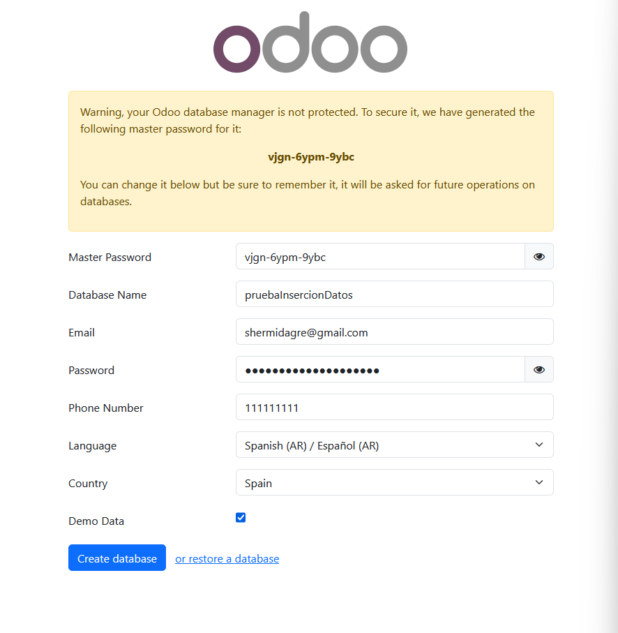
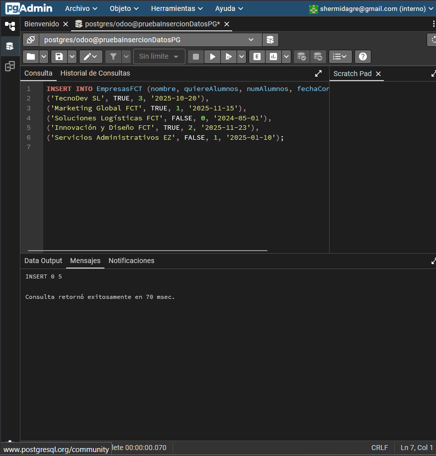
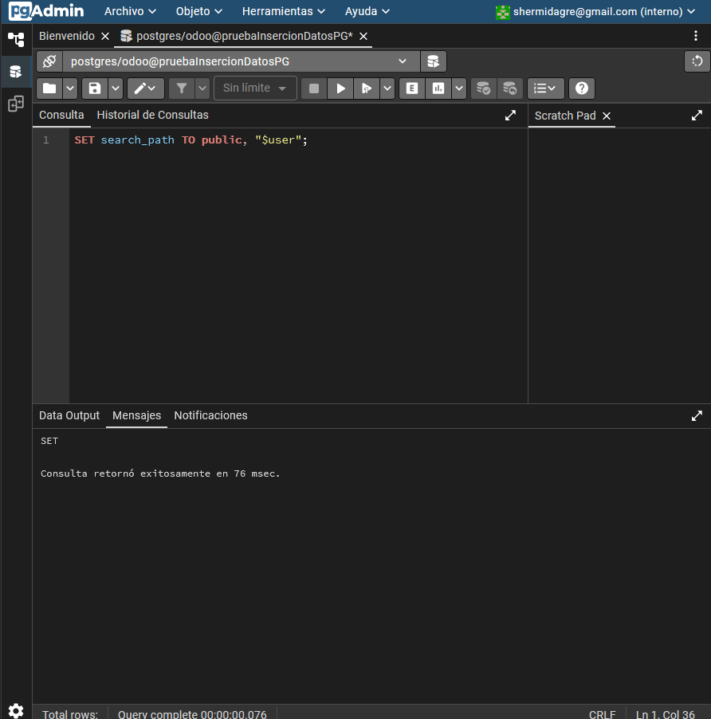
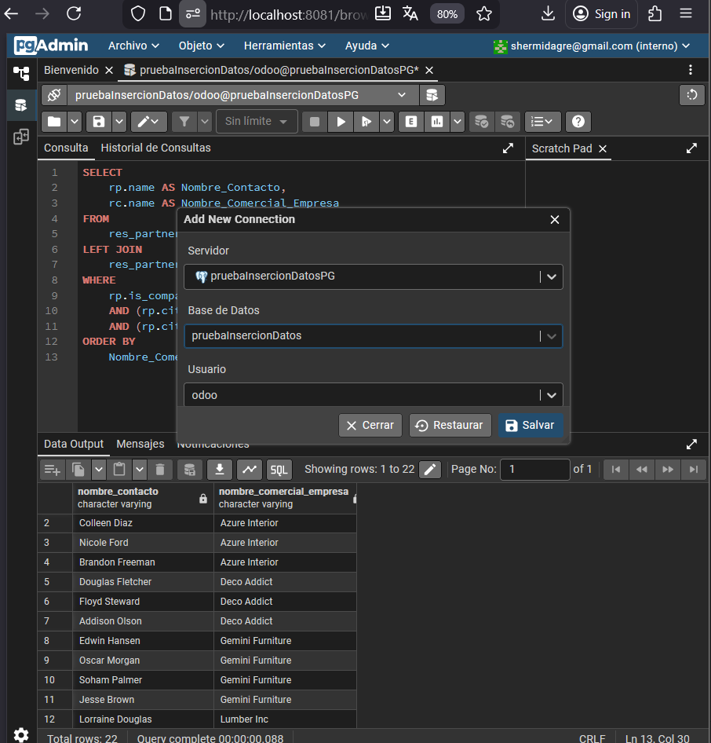
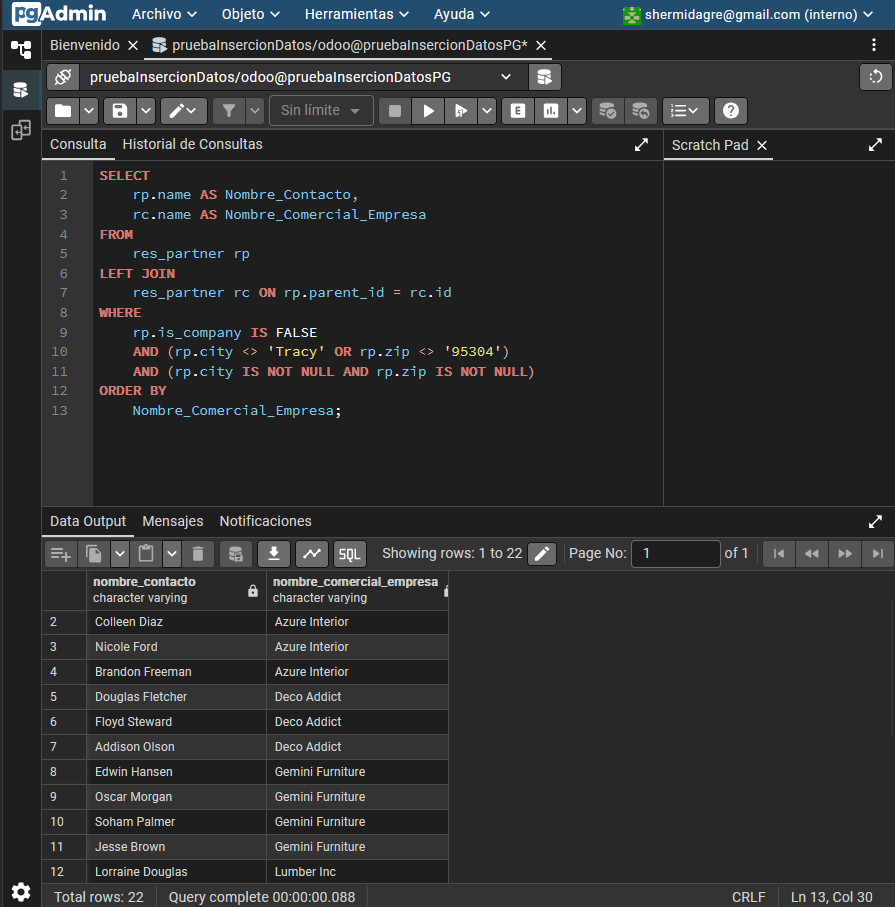

Valores de la db en el archivo .env

# Creacion de la nueva bd



### Importante seleccionar el modo demo

## Inicio despues de crear la bd
r


## Instalamos los modulos necesarios


## Configuramos la bd de pgadmin


### Revisamos si se ha creado correctamente la bd


#### Procedemos a realizar las consultas a la bd

Entramos en la query tool


### Como mencionamos en clase, aunque no es recomendable, en ocasiones puede ser
### necesario crear tablas ajenas a Odoo dentro de su base de datos (integración con
### sistemas externos, almacenamiento de históricos, datos temporales…). Mediante la
### herramienta PgAdmin u otro método que estimes oportuno, elabora y ejecuta una
### sentencia que cree una tabla llamada “EmpresasFCT“con los siguientes campos:
### ● idEmpresa: autonumérico. Este campo será la clave primaria.
### ● nombre: Texto con tamaño máximo de 40 caracteres. -useChatgpt: booleano, por defecto a true
### ● quiereAlumnos: Booleano.
### ● numAlumnos: número entero.
### ● fechaContacto: tipo fecha

```dotenv

CREATE TABLE EmpresasFCT (
    idEmpresa SERIAL PRIMARY KEY,
    nombre VARCHAR(40) NOT NULL,
    quiereAlumnos BOOLEAN,
    numAlumnos INTEGER,
    fechaContacto DATE
);

```


----
### Inserta 5 registros inventados en la tabla a través de una sentencia SQL.

```dotenv

INSERT INTO EmpresasFCT (nombre, quiereAlumnos, numAlumnos, fechaContacto) VALUES
('TecnoDev SL', TRUE, 3, '2025-10-20'),
('Marketing Global FCT', TRUE, 1, '2025-11-15'),
('Soluciones Logísticas FCT', FALSE, 0, '2024-05-01'),
('Innovación y Diseño FCT', TRUE, 2, '2025-11-23'),
('Servicios Administrativos EZ', FALSE, 1, '2025-01-10');

```

----

----

### Realiza una consulta donde se muestren todos los datos de la tabla EmpresasFCT
### ordenados por fechaContacto, de modo que en la primera fila salga el que tenga la
### fecha más reciente.

```dotenv

SELECT * FROM EmpresasFCT ORDER BY fechaContacto DESC;

```

----
### Realiza una consulta que permita obtener un listado de todos los contactos de
### Odoo (no empresas) con la siguiente información:
### - Nombre
### - Cuya ciudad NO sea Tracy, y código postal 95304
### - Nombre comercial de la empresa
### ordenados alfabéticamente por el nombre comercial de la empresa.

### Intente ponerlo directamente a pelo pero no iba creo que es por la ruta



# Creamos una nueva conexion para entrar en la base de datos de nuestro odoo



```dotenv

SELECT
    rp.name AS Nombre_Contacto,
    rc.name AS Nombre_Comercial_Empresa
FROM
    res_partner rp
LEFT JOIN
    res_partner rc ON rp.parent_id = rc.id -- Unir con la compañía padre
WHERE
    rp.is_company IS FALSE -- SOLO contactos que NO son empresas
    AND (rp.city <> 'Tracy' OR rp.zip <> '95304') -- Cuya ciudad NO sea Tracy O código postal NO sea 95304
    AND (rp.city IS NOT NULL AND rp.zip IS NOT NULL) -- Se asume que deben tener ciudad y zip para la condición
ORDER BY
    Nombre_Comercial_Empresa;
````




