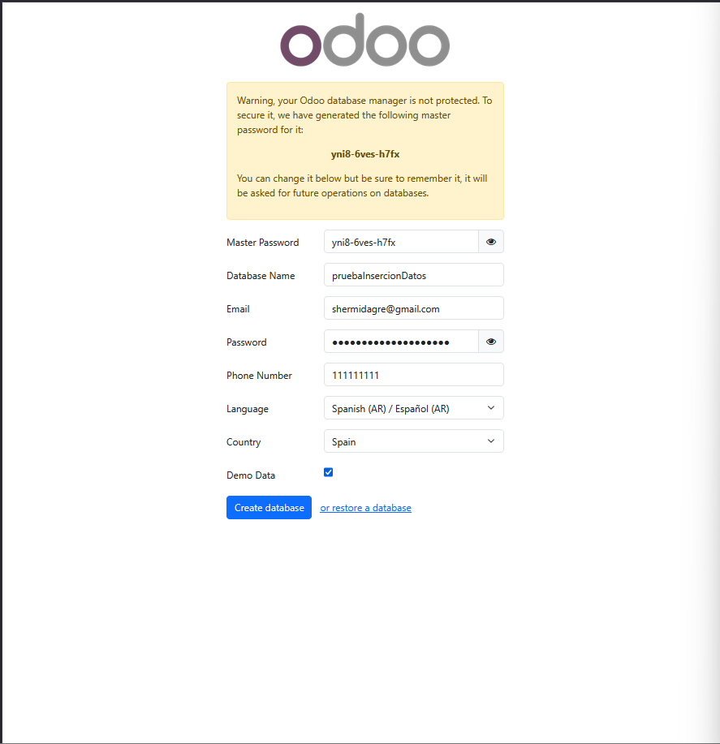
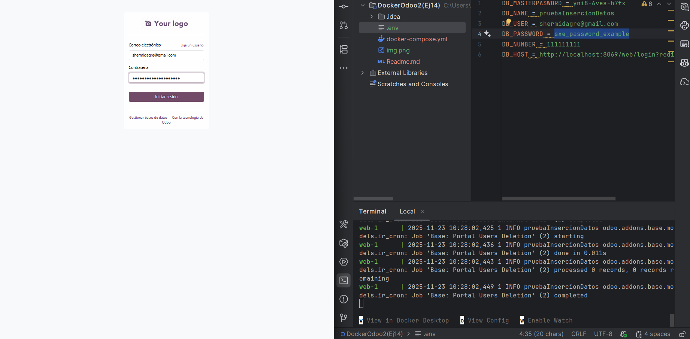
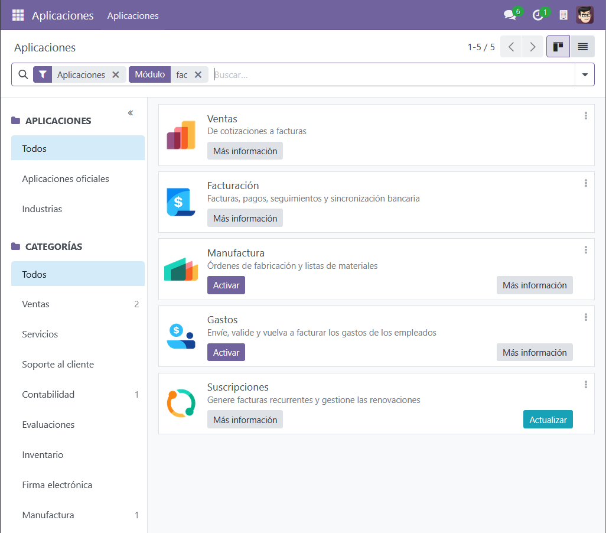
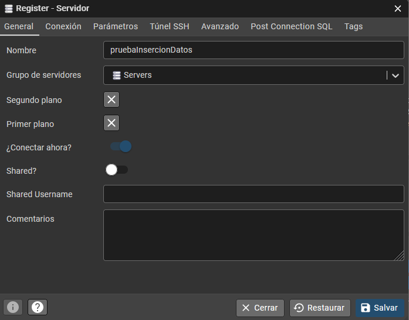
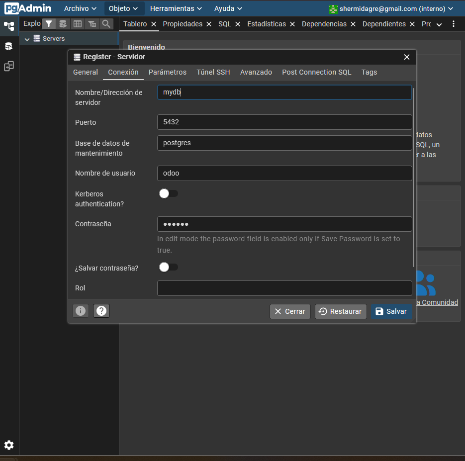
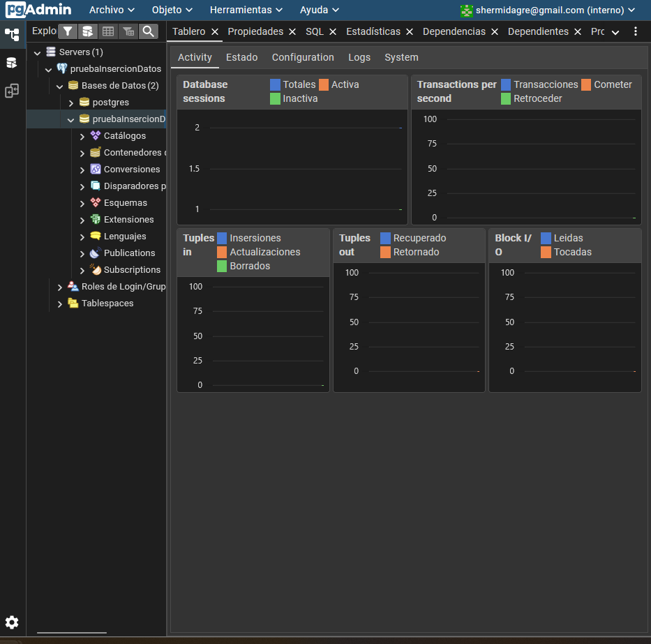
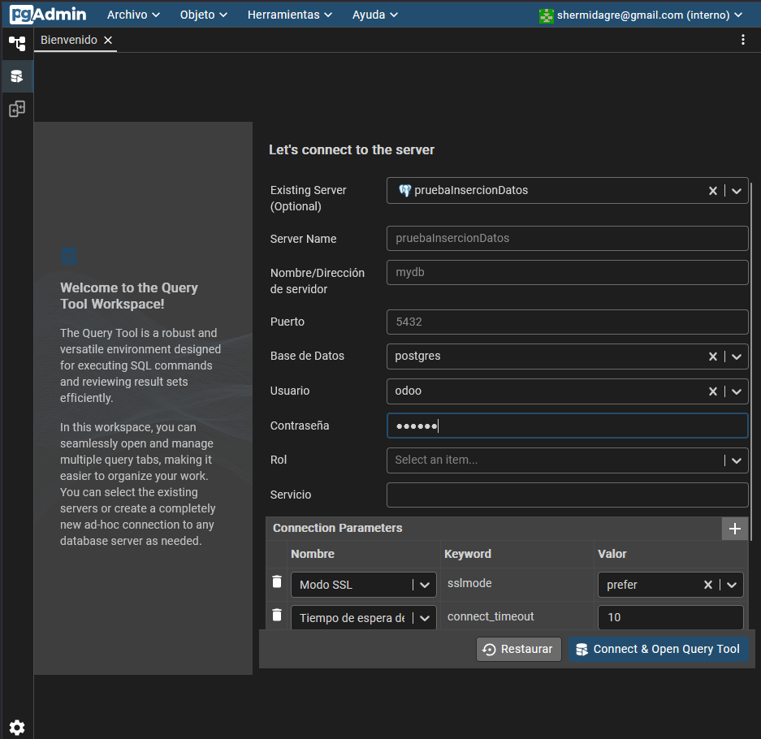
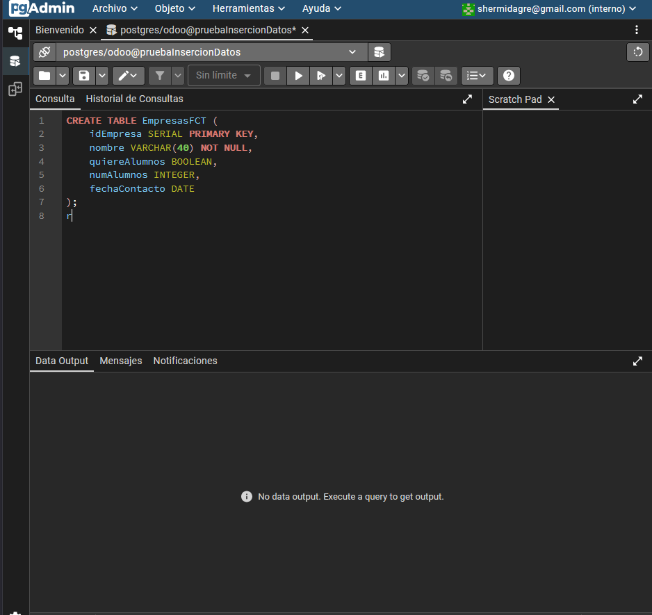

Valores de la db en el archivo .env

# Creacion de la nueva bd



### Importante seleccionar el modo demo

## Inicio despues de crear la bd



## Instalamos los modulos necesarios



## Configuramos la bd de pgadmin





### Revisamos si se ha creado correctamente la bd



#### Procedemos a realizar las consultas a la bd

Entramos en la query tool




```dotenv

CREATE TABLE EmpresasFCT (
    idEmpresa SERIAL PRIMARY KEY,
    nombre VARCHAR(40) NOT NULL,
    quiereAlumnos BOOLEAN,
    numAlumnos INTEGER,
    fechaContacto DATE
);

```



----

